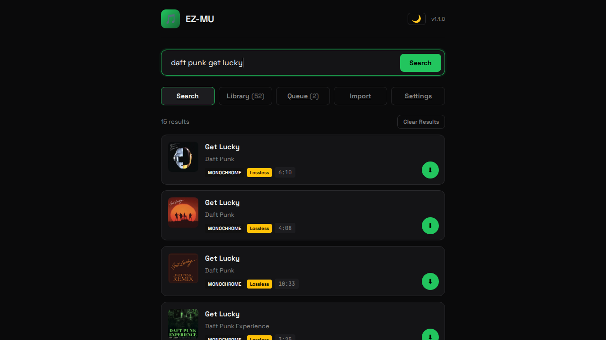
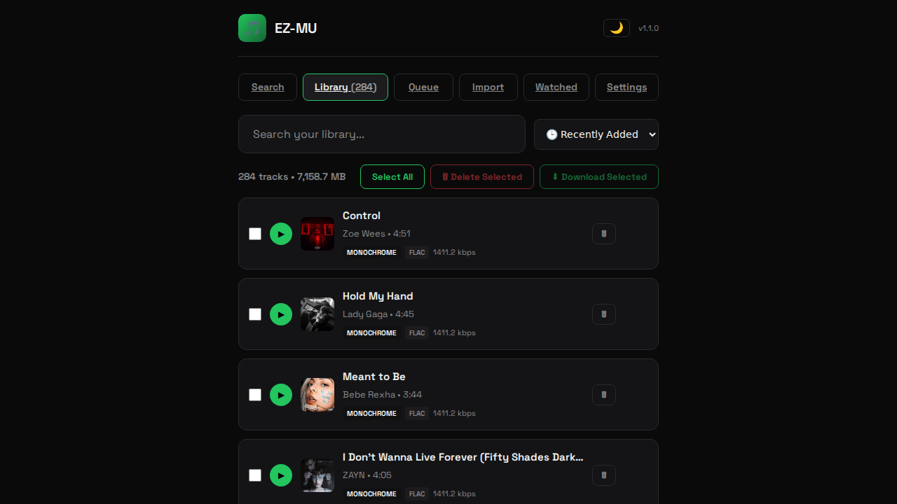
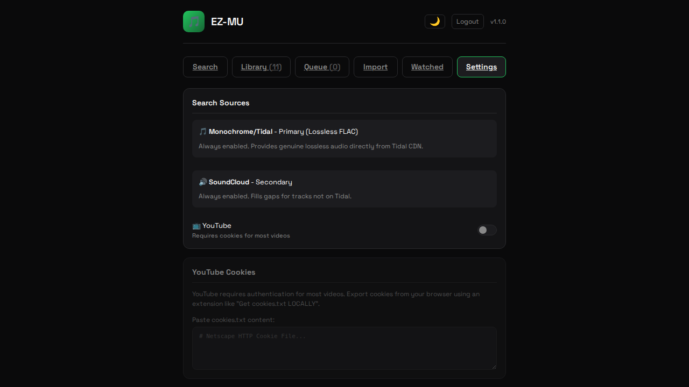
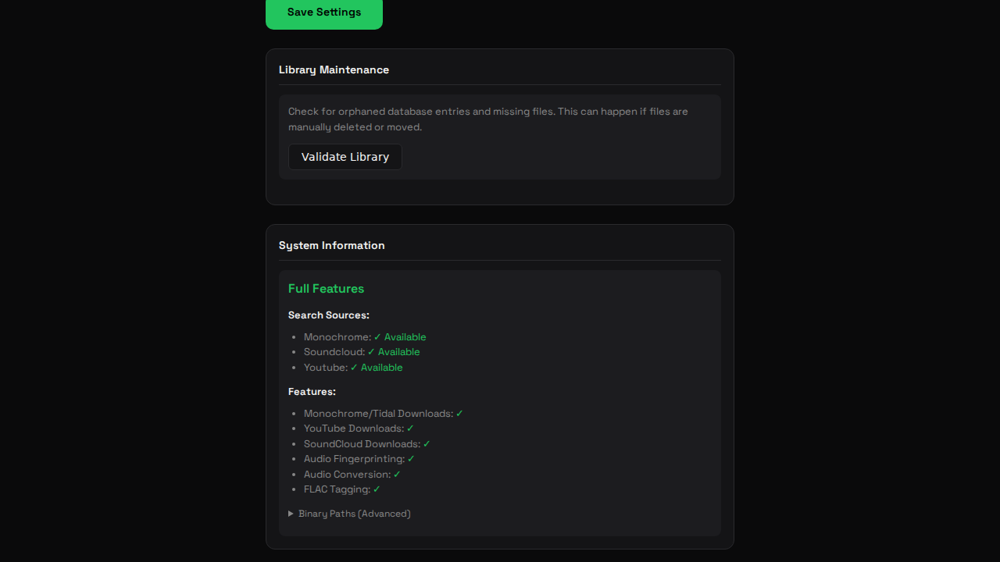

# EZ-MU 🎵

A self-hosted music acquisition service built with PHP, HTMX, and Slim 4.

**🌐 Shared Hosting Compatible** - Works on standard PHP hosting without shell access or special binaries.

Refactored from [MusicGrabber](https://gitlab.com/g33kphr33k/musicgrabber) - a Python/FastAPI app - into a lightweight PHP implementation.

## Screenshots

<table>
  <tr>
    <td><strong>Search</strong><br></td>
    <td><strong>Library</strong><br></td>
  </tr>
  <tr>
    <td><strong>Settings</strong><br></td>
    <td><strong>System Info</strong><br></td>
  </tr>
</table>

## Features

- **🎵 Monochrome/Tidal** - Lossless FLAC downloads from Tidal CDN (no account needed)
- **📝 Playlist Import** - Import from Spotify, Apple Music, YouTube Music, Tidal
- **👁️ Watched Playlists** - Monitor playlists for new tracks, auto-download, generate M3U files
- **🎧 Library & Playback** - Stream music directly in the browser (HTML5 audio)
- **🎯 MusicBrainz** - Automatic metadata enrichment (artist, album, year)
- **⬇️ Export** - Download multiple tracks as a zip file
- **🌙 Dark/Light Theme** - Toggle with saved preference
- **📱 Mobile-friendly** - Responsive design

### Full Features (VPS/Dedicated)

- **YouTube Search** - Via yt-dlp (requires cookies)
- **SoundCloud Search** - Via yt-dlp
- **Audio Fingerprinting** - AcoustID for precise metadata matching

## Tech Stack

- **Backend**: PHP 8.1+ with Slim 4 microframework
- **Frontend**: HTMX + Twig templates (minimal JavaScript)
- **Database**: SQLite (zero configuration)
- **Audio**: Pure PHP FLAC handling (no ffmpeg required for core features)
- **CSS**: Custom dark theme (Spotify-inspired)

## Automatic Environment Detection

EZ-MU automatically detects available system capabilities and adjusts features accordingly:

| Tool | Feature | Shared Hosting Fallback |
|------|---------|------------------------|
| `yt-dlp` | YouTube/SoundCloud search & download | Monochrome/Tidal only |
| `ffmpeg` | Audio format conversion | Direct FLAC download |
| `fpcalc` | Audio fingerprinting (AcoustID) | Text-based MusicBrainz lookup |
| `metaflac` | FLAC metadata writing | Pure PHP FlacWriter |

Check **Settings → System Information** to see detected capabilities and current mode.

## Requirements

### Minimum (Shared Hosting)

- PHP 8.1+ with extensions: `pdo_sqlite`, `curl`, `mbstring`, `zip`
- Composer (or upload vendor folder)

### Full Features (VPS)

- Everything above, plus:
- yt-dlp (for YouTube/SoundCloud)
- ffmpeg (for audio conversion)
- fpcalc (for audio fingerprinting)

## Quick Start

```bash
# Clone the repository
git clone https://github.com/jgbrwn/ez-mu.git
cd ez-mu

# Install PHP dependencies
composer install

# Create directories
mkdir -p data music/Singles

# Optional: Configure environment variables
cp .env.example .env
# Edit .env to add your AcoustID API key (for audio fingerprinting)

# Start the development server
php -S 0.0.0.0:8000 -t public
```

See [DEPLOYMENT.md](DEPLOYMENT.md) for detailed shared hosting and production deployment instructions.

## Configuration

Settings are stored in SQLite and can be managed via the Settings page:

- **Organize by Artist** - Create artist subdirectories in your music folder
- **Convert to FLAC** - Convert YouTube/SoundCloud downloads to FLAC (only shown when yt-dlp is available; Monochrome/Tidal downloads are always lossless FLAC)
- **MusicBrainz Lookup** - Enrich metadata with artist, album, and year information
- **YouTube Search** - Enable/disable YouTube as a search source
- **Theme** - Dark or light mode

## Usage

### Search & Download

1. Enter a song name or artist in the search box
2. Click "Download" on any result
3. Track will be queued and processed automatically
4. Find completed downloads in the Library tab

> **Note:** Downloaded/queued items fade from search results after 4 seconds.
> Completed jobs are automatically cleared from the Queue after 30 minutes.

### Library & Playback

1. Go to the Library tab
2. Click the play button (▶) on any track to stream it
3. Use the audio player controls at the bottom

### Download Selected Tracks

1. Check the boxes next to tracks you want
2. Click "Download Selected"
3. For multiple tracks, you'll get a zip file

### Watched Playlists

Monitor playlists and automatically download new tracks:

1. Go to the Watched tab
2. Enter a playlist URL (Spotify, YouTube, Tidal, or Amazon Music)
3. Choose sync mode:
   - **Append**: Keep all downloaded tracks even if removed upstream
   - **Mirror**: M3U reflects current playlist state
4. Enable M3U generation for playlist files
5. Set refresh interval (how often to check for new tracks)
6. Click "Add & Start Watching"

Tracks are queued in small batches to avoid timeouts on shared hosting.

## YouTube Authentication

YouTube may require authentication for some videos. Options:

1. **Cookies** - Export cookies from your browser and configure yt-dlp
2. **Use SoundCloud** - SoundCloud results work without authentication

See [yt-dlp wiki](https://github.com/yt-dlp/yt-dlp/wiki/FAQ#how-do-i-pass-cookies-to-yt-dlp) for cookie setup.

## Project Structure

```
ez-mu/
├── public/           # Web root
│   ├── index.php     # Front controller
│   └── static/       # CSS, images
├── src/
│   ├── Controllers/  # Route handlers
│   └── Services/     # Business logic
├── templates/        # Twig templates
├── config/           # App configuration
├── data/             # SQLite database
└── music/            # Downloaded files
```

## API Endpoints

| Method | Endpoint | Description |
|--------|----------|-------------|
| GET | / | Home page |
| POST | /search | Search music (HTMX) |
| POST | /download | Queue a download |
| GET | /queue | Queue page |
| GET | /library | Library page |
| GET | /stream/{id} | Stream audio file |
| POST | /library/download | Download selected tracks |
| GET | /settings | Settings page |
| GET | /watched | Watched playlists page |
| POST | /watched/add | Add watched playlist |
| GET | /watched/{id} | View playlist tracks |
| POST | /watched/{id}/refresh | Check for new tracks |
| POST | /watched/{id}/queue | Queue pending tracks |

## Credits

- Original [MusicGrabber](https://gitlab.com/g33kphr33k/musicgrabber) by Karl
- [HTMX](https://htmx.org/) for the hypermedia approach
- [Slim Framework](https://www.slimframework.com/)
- [yt-dlp](https://github.com/yt-dlp/yt-dlp) for audio extraction

## License

MIT - Do whatever you want with it. 🤷
